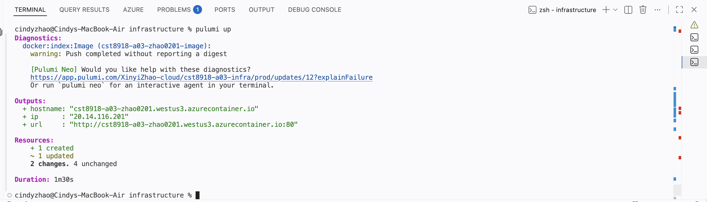
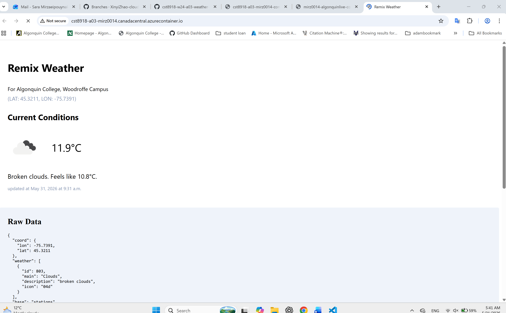
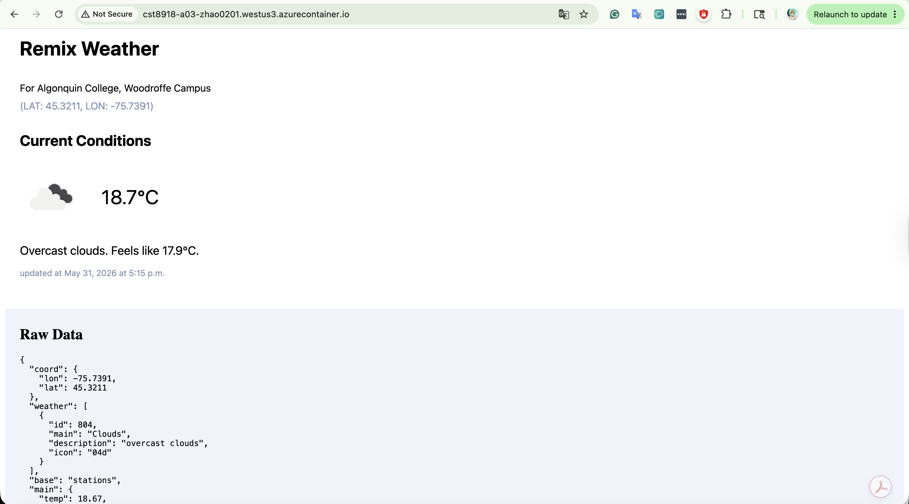
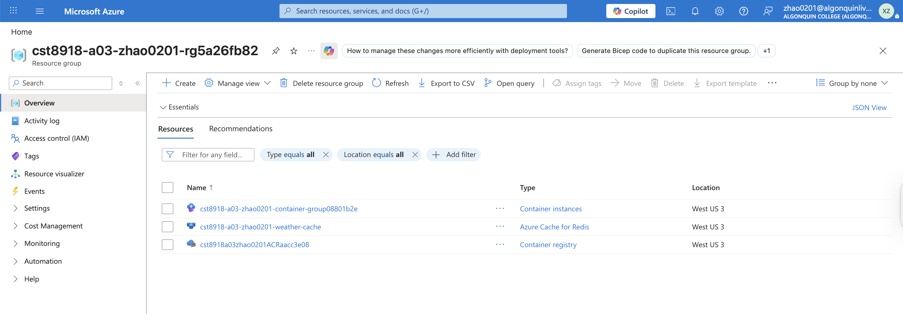
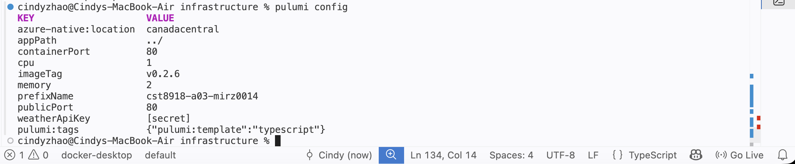

# CST8918 – Hybrid H03 Submission

## Student Information

| Field | Details |
|---------|---------|
| Students Name | Xinyi Zhao - Sara Mirzaei |
| Course | CST8918 – Cloud Development and Operations |
| Lab | Hybrid H03 |
| Branch Name | `hybrid-h03` |
| Repository | https://github.com/XinyiZhao-cloud/cst8918-w24-a03-weather-pulumi/tree/hybrid-h03 |

---

# Overview

This hybrid lab extends the Lab A03 solution by improving application security and scalability. The application was updated to use encrypted Pulumi secrets for the OpenWeather API key and Azure Cache for Redis for distributed caching. The infrastructure was updated and redeployed using Pulumi.

---

# Task 1 – Secret Management

## Description

Removed the hardcoded OpenWeather API key and configured it as an encrypted Pulumi secret.

## Commands Used

```bash
pulumi config set weatherApiKey <your-api-key> --secret
```

## Verification

- API key stored as encrypted Pulumi configuration
- Application successfully accessed the API using the secret value

---

# Task 2 – Redis Client Integration

## Description

Added Redis support to the application and replaced the in-memory cache implementation.

## Changes Made

- Installed Redis client dependency
- Created reusable Redis connection module
- Updated weather service to use Redis caching
- Configured cache expiration using Redis key expiration

## Commands Used

```bash
npm install redis
```

---

# Task 3 – Local Redis Testing

## Description

Tested the application locally using a Redis container.

## Commands Used

```bash
docker run -p 6379:6379 -it redis/redis-stack-server:latest

npm run dev
```

## Verification

- Redis container running successfully
- Weather data cached through Redis
- Application loaded correctly in local development environment

---

# Task 4 – Azure Redis Deployment

## Description

Provisioned Azure Cache for Redis and updated Pulumi infrastructure configuration.

## Infrastructure Added

- Azure Cache for Redis
- Redis access key retrieval
- Redis connection string generation
- REDIS_URL environment variable injection
- Secure WEATHER_API_KEY configuration using Pulumi secrets

---

# Task 5 – Application Redeployment

## Description

Updated the application image version and redeployed the infrastructure.

## Commands Used

```bash
pulumi config set imageTag "v0.3.0"

pulumi up
```

## Verification

- Azure Container Registry updated
- Container image rebuilt and pushed
- Azure Container Instance redeployed
- Azure Cache for Redis provisioned successfully

---

# Application Verification

## Description

Verified that the application was deployed successfully and connected to Azure Redis.

## Verification Steps

- Verified application accessibility through Azure Container Instance URL
- Verified successful Pulumi deployment
- Verified Redis service creation
- Verified weather data loading successfully
- Verified secret configuration working correctly

---

# Git Branch Information

## Current Branch

```bash
git branch
```

---

# Final Result

The application was successfully updated to use Redis caching and secure secret management. Azure Cache for Redis was provisioned through Pulumi, environment variables were updated, and the application was redeployed successfully to Azure Container Instances.

---

# Screenshots

## Pulumi Deployment Output



---

## Running Application Screenshot

> 
> 
---

## Azure Resource Group

> 
---


## Make API secret

> 
---


